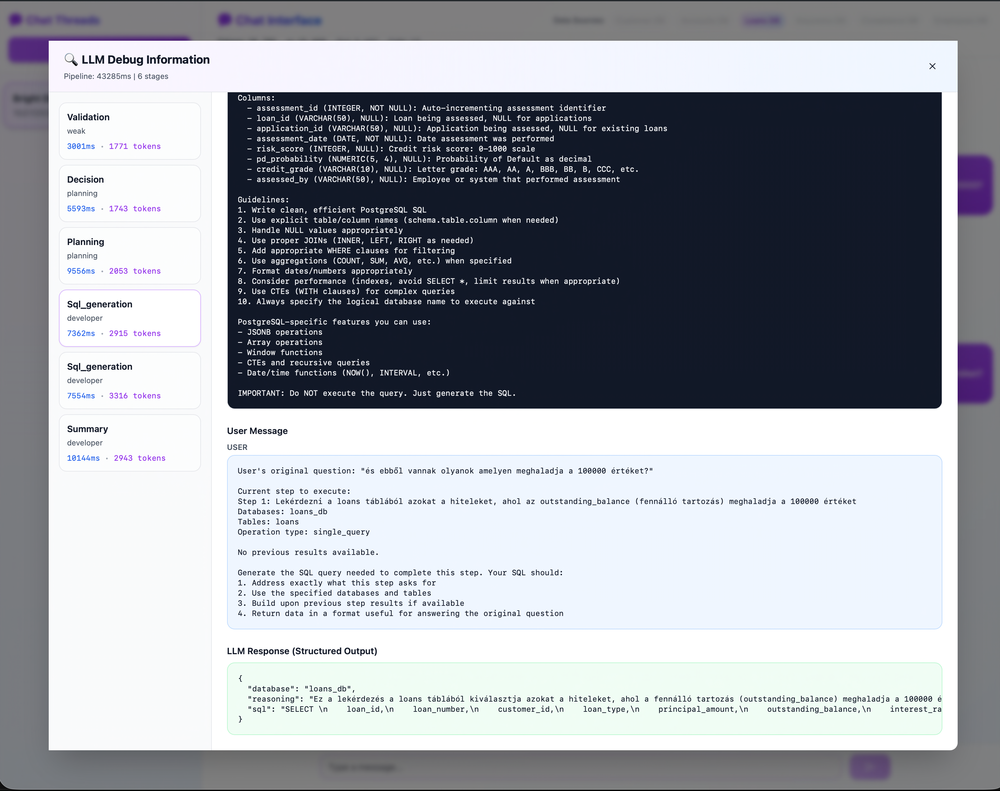

# AI Data Agent - Natural Language to SQL

An intelligent chat application that converts natural language questions into SQL queries using Claude AI. Built with Flask (Python) and React (TypeScript).

---

## 📚 Documentation

**⭐ Complete documentation is available in the `/docs` directory:**

- **[Getting Started](./docs/guides/GETTING_STARTED.md)** - Quick setup guide
- **[Complete Overview](./docs/README.md)** - Current state and features
- **[System Architecture](./docs/architecture/SYSTEM_ARCHITECTURE.md)** - How it all works
- **[Documentation Index](./docs/INDEX.md)** - Find anything

---

## 📸 Preview

### Chat Interface


*Natural language conversation with AI-powered query planning and database badge highlighting*

### Detailed AI Working



*Multi-stage LLM pipeline with token tracking, debug panel, and step-by-step execution*

---

## Features

- **AI-Powered Query Planning**: Multi-stage LLM orchestration converts natural language to SQL queries
  - Five-stage pipeline: validation → decision → planning → execution → summary
  - Multi-model support (Claude Haiku 4 for validation, Sonnet 4.5 for planning/execution)
  - Structured outputs using Pydantic schemas
  - Agentic SQL generation with automatic error recovery (up to 5 retries per step)
- **Multi-Database Support**: Query across 6 different database schemas (customer, accounts, loans, insurance, compliance, employees)
- **Token Tracking**: Real-time token usage tracking and display per conversation thread
- **Database Usage Visualization**: Visual highlighting of which databases are used in each thread
- **Thread Management**: Create and manage multiple chat threads
- **Debug Panel**: Expandable panel showing all LLM interactions, token counts, and response times
- **In-memory storage** with abstraction layer for easy migration to persistent databases
- **Modern UI**: Clean interface with shadcn/ui components, data source badges, and debug panels
- **Datasource Abstraction**: Support for PostgreSQL with extensible architecture for additional databases

## Project Structure

```
.
├── backend/                 # Flask API backend
│   ├── app/
│   │   ├── __init__.py     # Flask app factory
│   │   ├── storage.py      # Storage abstraction layer
│   │   ├── routes.py       # API endpoints
│   │   ├── llm/           # LLM integration
│   │   │   ├── client.py   # Claude API client
│   │   │   ├── orchestrator.py  # Multi-stage query pipeline
│   │   │   ├── schemas.py  # Pydantic models for structured outputs
│   │   │   └── prompts.py  # YAML prompt loader
│   │   └── datasources/   # Database connectors
│   │       ├── base.py     # Abstract datasource interface
│   │       ├── postgresql.py  # PostgreSQL implementation
│   │       └── manager.py  # Datasource routing
│   ├── knowledge/         # AI knowledge base
│   │   ├── data_schemas/  # Database schema definitions (YAML)
│   │   ├── prompts/       # LLM prompt templates (YAML)
│   │   ├── docs/          # Documentation
│   │   └── datasources.yaml  # Datasource configurations
│   ├── run.py            # Development entry point
│   ├── main.py           # Production ASGI app
│   ├── .env.example      # Environment config template
│   └── pyproject.toml    # Python dependencies (uv)
│
└── frontend/             # React frontend
    ├── src/
    │   ├── components/   # React components
    │   │   ├── ChatInterface.tsx  # Main chat UI
    │   │   ├── ThreadList.tsx     # Thread sidebar
    │   │   ├── DataSourceBadges.tsx  # DB badges
    │   │   ├── TokenDisplay.tsx   # Token usage display
    │   │   └── ui/       # shadcn/ui primitives
    │   ├── lib/         # Utilities and API client
    │   ├── App.tsx      # Main application component
    │   └── main.tsx     # Application entry point
    ├── package.json     # Node dependencies
    └── vite.config.ts   # Vite configuration
```

## Backend Architecture

### LLM Query Planning System
The application uses a sophisticated three-stage pipeline to convert natural language questions into SQL queries:

1. **Validation Stage** (Claude Haiku 4): Validates if the question is relevant to available databases
2. **Decision Stage** (Claude Sonnet 4.5): Decides whether to create a plan, ask for clarification, or reject
3. **Planning Stage** (Claude Sonnet 4.5): Creates a detailed SQL query plan with step-by-step instructions

All LLM interactions use structured outputs via Anthropic's tool use feature with Pydantic schemas for type safety.

### Datasource Management
- **Abstract Interface**: `DatasourceInterface` allows easy addition of new database types
- **PostgreSQL Support**: Full implementation with connection pooling using psycopg3
- **Logical to Physical Mapping**: Map logical databases (customer_db, accounts_db) to physical schemas
- **Configuration**: YAML-based datasource configuration with environment variables for credentials

### Storage Layer
The backend uses an abstract storage interface (`StorageInterface`) with an in-memory implementation (`InMemoryStorage`). This design allows easy migration to other storage systems (PostgreSQL, Redis, etc.) by implementing the same interface.

### API Endpoints

- `GET /api/threads` - Get all threads
- `POST /api/threads` - Create a new thread
- `GET /api/threads/:id` - Get a specific thread
- `GET /api/threads/:id/messages` - Get messages for a thread
- `POST /api/threads/:id/messages` - Send a message (processes through LLM pipeline)
- `GET /api/threads/:id/tokens` - Get token usage statistics for a thread
- `GET /api/data-sources` - Get available data sources and their descriptions

## Prerequisites

- Python 3.10+
- Node.js 18+
- [uv](https://github.com/astral-sh/uv) - Python package manager
- **Anthropic API Key** - Required for LLM functionality ([Get one here](https://console.anthropic.com/))

### Installing uv

```bash
# macOS/Linux
curl -LsSf https://astral.sh/uv/install.sh | sh

# Windows
powershell -c "irm https://astral.sh/uv/install.ps1 | iex"
```

## Setup and Installation

### Backend Setup

1. Navigate to the backend directory:
```bash
cd backend
```

2. Create and configure the environment file:
```bash
cp .env.example .env
```

Edit `.env` and configure:
- `ANTHROPIC_API_KEY` - Your Anthropic API key (required)
- `ANTHROPIC_WEAK_MODEL` - Model for validation (default: claude-haiku-4-5)
- `ANTHROPIC_PLANNING_MODEL` - Model for planning (default: claude-sonnet-4-5-20250929)
- `ANTHROPIC_DEVELOPER_MODEL` - Model for SQL generation (default: claude-sonnet-4-5-20250929)
- `LLM_DEBUG` - Enable debug logging (optional, set to `true`)
- PostgreSQL configuration (optional, for database connections)

3. Install dependencies using uv:
```bash
uv sync
```

4. Run the server (choose one):

**Option A: Uvicorn (recommended)**
```bash
uv run uvicorn main:app --host 0.0.0.0 --port 5001 --reload
```

**Option B: Flask development server**
```bash
python run.py
```

The backend will start at `http://localhost:5001`

### Frontend Setup

1. Navigate to the frontend directory:
```bash
cd frontend
```

2. Install dependencies:
```bash
npm install
```

3. Start the development server:
```bash
npm run dev
```

The frontend will start at `http://localhost:3001`

## Usage

1. Start both the backend and frontend servers
2. Open your browser to `http://localhost:3001`
3. Click "New Thread" to create a chat thread
4. Ask natural language questions about your data, for example:
   - "Show me all customers from California"
   - "What are the total loans by customer?"
   - "List active insurance policies"
5. The AI will:
   - Validate your question against available databases
   - Decide on the appropriate action
   - Create a detailed query plan (SQL execution coming soon)
6. Monitor token usage in real-time for each thread
7. View which databases are being queried via data source badges
8. Create multiple threads and switch between them

## Development

### Backend Development

The backend uses:
- **Flask** - Web framework
- **Flask-CORS** - Cross-Origin Resource Sharing
- **Anthropic** - Claude AI SDK for LLM integration
- **Pydantic** - Data validation and structured outputs
- **PyYAML** - YAML configuration files
- **psycopg3** - PostgreSQL database adapter
- **python-dotenv** - Environment variable management
- **uv** - Fast Python package installer and resolver

To add new dependencies:
```bash
# Edit pyproject.toml, then:
uv sync
```

**Key Extension Points:**
- Add new LLM prompts: Create YAML files in `backend/knowledge/prompts/`
- Add new database schemas: Create YAML files in `backend/knowledge/data_schemas/`
- Add new datasource types: Implement `DatasourceInterface` in `backend/app/datasources/`
- Add structured output schemas: Define Pydantic models in `backend/app/llm/schemas.py`

### Frontend Development

The frontend uses:
- **React 18** - UI library
- **TypeScript** - Type safety
- **Vite** - Build tool
- **Tailwind CSS** - Styling
- **shadcn/ui** - Component library
- **Radix UI** - Headless UI components

To add new dependencies:
```bash
npm install <package-name>
```

## Roadmap

### Completed Features ✅
- ✅ LLM-powered query planning with five-stage pipeline
- ✅ Multi-model support (Haiku 4 + Sonnet 4.5)
- ✅ **Agentic SQL execution with automatic error recovery**
- ✅ **Multi-step query execution** - Complex queries across databases
- ✅ **Result formatting** - Natural language summaries from query results
- ✅ Token tracking and display per thread
- ✅ **Database usage tracking** - Per-thread visualization
- ✅ Datasource abstraction layer with PostgreSQL support
- ✅ YAML-based configuration for schemas and prompts
- ✅ Structured outputs with Pydantic
- ✅ Debug logging with full prompt/response visibility
- ✅ **UI highlighting** - Dimmed/active database badges
- ✅ **Error categorization** - Syntax, schema, connection, data errors

### Coming Soon
- [ ] **Query result tables/charts** - Visual data presentation
- [ ] **Query optimization** - Analyze and improve generated SQL
- [ ] **Result caching** - Cache frequently used queries
- [ ] Replace in-memory storage with persistent database
- [ ] Add user authentication and authorization
- [ ] Query history and favorites
- [ ] Export results (CSV, JSON, Excel)
- [ ] Streaming responses (SSE)
- [ ] Deploy to production

## License

MIT
